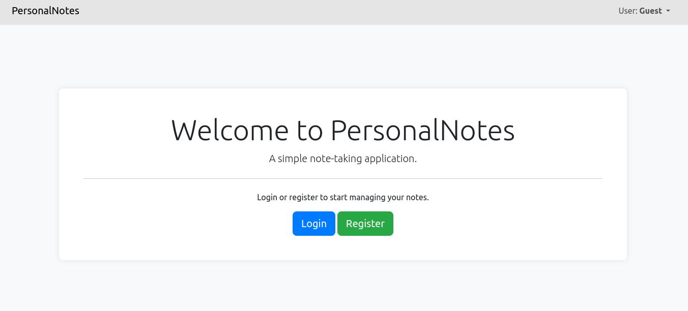
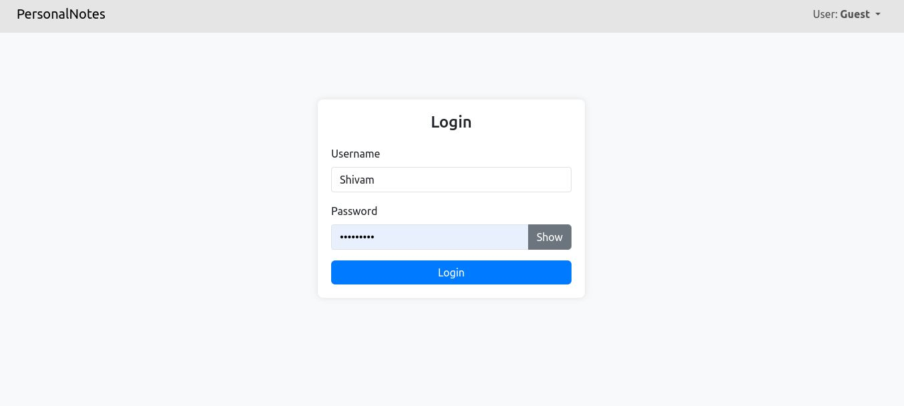
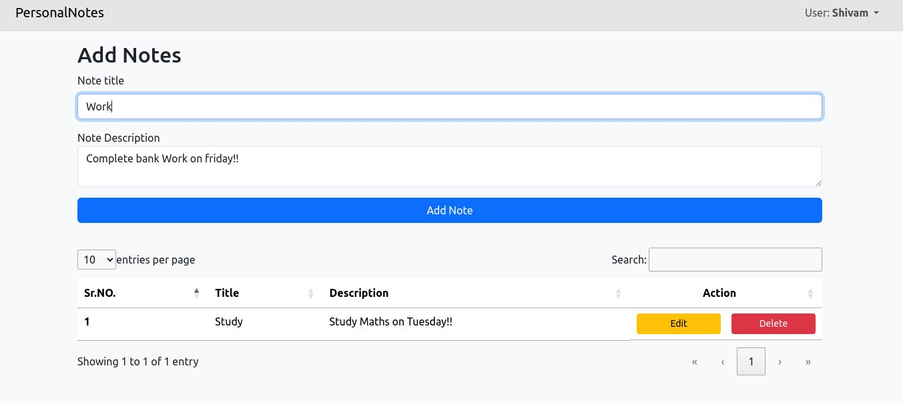
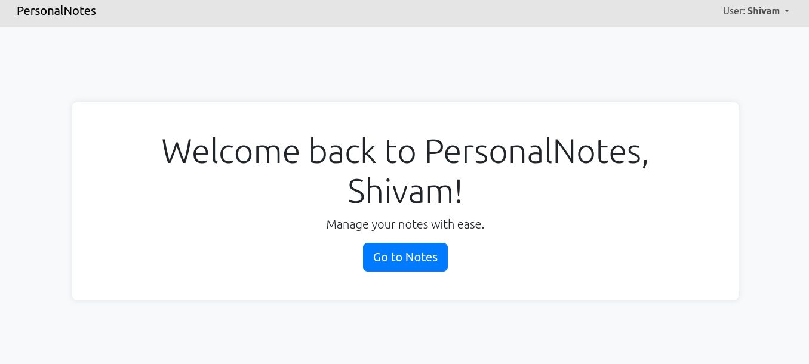
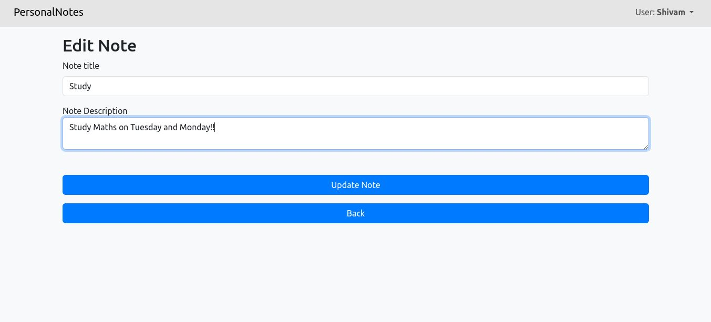
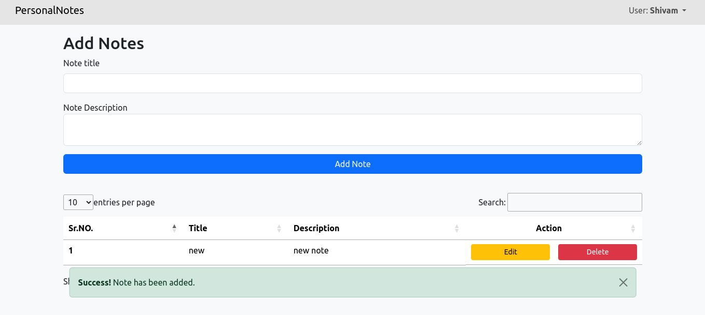

# Personal Notes

It is a simple and modern note-taking application built with PHP and MySQL. This project allows users to register, log in, and manage their notes with ease. The application includes features such as creating, editing, and deleting notes, and ensures that each user's notes are private.

## Features

- User Authentication (Registration, Login, Logout)
- Create, Edit, and Delete Notes
- User-specific Notes
- Search Functionality for Notes
- Modern and responsive design using Bootstrap

## Screenshots

### Slider Images








## Installation

### Prerequisites

- PHP >= 7.4
- MySQL
- Composer
- Git

### Steps

1. Clone the repository

2. Install dependencies

3. Set up the database:

   - Create a MySQL database for the project.
   - Import the database schema:

     ```sql
     CREATE DATABASE personalNotes;
     USE personalNotes;
     -- Import the sql file
     schema/notes.xml;
     schema/users.xml;
     ```

4. Configure the database connection:

   - Update the database configuration:

     ```
      private $servername = "";
      private $username = "";
      private $password = "";
      private $dbname = "";
     ```

5. Start the PHP built-in server (or configure your web server):

6. Open your browser and navigate to Running Server.

## Usage

### Register

1. Go to the register page.
2. Fill in the required details and submit the form.

### Login

1. Go to the login page.
2. Enter your credentials and submit the form.

### Manage Notes

1. Once logged in, you can create, edit, and delete notes from the notes page.

## License

This project is licensed under the MIT License. See the [LICENSE](LICENSE) file for details.

## Contributing

Contributions are welcome! Please open an issue or submit a pull request for any improvements or bug fixes.
